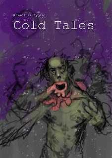

# Cold Tales: Po drugiej stronie Berlina

---

Ilustracja: Piotr RYGIEL

Materiał to zbiór zapisów filmowych sesji gry fabularnej Cold City.

Początkowo teksty były publikowane na blogu w serwisie Poltergeist, a następnie na niniejszej stronie.

Projekt można wykorzystać na wiele różnych sposobów. Rozgrywając na jego podstawie scenariusze, zapoznając nowych Graczy z jedną z możliwych wizji rozgrywki, czy też jako luźną bazę pomysłów.

[Cold Tales: Po drugiej stronie Berlina PDF (Pobierz)](https://drive.google.com/file/d/1EOlqip-omXIhlpWkC4TrEDWRGashanf8/view?usp=sharing)