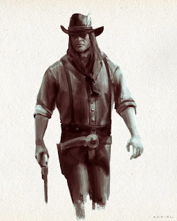

# Epizod 6: "Figury Domu La Rue"

---

Ilustracja: Piotr RYGIEL

W piątek 14 października 2022 r. rozgrywaliśmy epizod 6 kampanii do Deadlands "Wszystkie przebrania Alistaira Kanta" zatytułowany "Figury Domu La Rue".

**Deadlands: Martwe Ziemie**
**Kampania "Wszystkie przebrania Alistaira Kanta"**

**Epizod 6: "Figury Domu La Rue"**

**Scena 1. "Prawdy o Tajemniczym Domostwie - Saloon 10 shots - pokoje"**

Bohaterowie Graczy dowiadują się, że Dom La Rue to więzienie zbudowane dla Duchów, z których mocy korzystał mag Alistair Kant. Chłopiec Herbert jest "Waletem Żalu", jego matka Pani Abigail "Damą Kłamstwa", Czerwony Szeryf był "Asem Płomieni", Klucznik z Krainy Wielu Drzwi "Asem Przejść". Domem włada Walkelin La Rue "Król Głupców". Protagoniści dowiadują się, że wejście do Domostwa musi poprzedzić okazanie kart do gry, na których będą znajdować się ich wizerunki. Takie karty mogą otrzymać jedynie od Jean-Pierre Bassarda "Waleta Wizerunków".

**Scena 2. "Szalony artysta - dom kolonialny"**

Jean-Pierre Bassard mieszka w starym domu kolonialnym za miastem. Jego rezydencję otaczają liczne nieużytki. Posesja jest zaniedbana. Wejścia do domu strzeże sześć czarnych jak noc brytanów. Bohaterowie będąc na miejscu przekraczają zniszczoną bramę. Twik dzięki swoim umiejętnościom tresury i zdolności panowania nad zwierzętami umożliwia Posse dostanie się do wewnętrznej części budynku. W środku pośród przestrzeni przyozdobionych psychodelicznymi obrazami spotykają Bassarda, który napawa się widokiem najnowszych wizji. Szalony malarz chce odzyskać swoje pędzle, które ukradło mu kuzynostwo Rosaline i Rafael Laffitte. Ponownie rewolwer Timothy'ego zaczyna lśnić. Crawford wychodzi szybkim krokiem i samotnie rusza odebrać należność.

**Scena 3. "Parowiec Królowa Gwiazd - brzeg rzeki Hollow River"**

Posse z doniesień malarza wie, że na statku odbywają się w weekendy bale, na których bywają bogaci i wpływowi ludzie. Znaczną część swoich majątków posiadają dzięki grom organizowanym w Domu La Rue. Jeśli ktoś znika nikt nie zadaje pytań. Takie są zasady w "grze o najwyższe stawki". Parowiec jest ochraniany przez ludzi Cartridge Jacka Biltona. Bohaterowie decydują się rozpoznać parowiec i zinfiltrować jego ochronę. Finalnie Posse ma zamiar odebrać "Instrumentarium Bassarda". Rosaline Laffitte to "Dama Złodziei". Jej skarłowaciały brat Rafael jest "Waletem Deformacji". Rodzeństwo nie ma zamiaru dobrowolnie oddać narzędzi artysty.

Ciąg dalszy nastąpi...
Czarne tło...
Muzyka...

Napisy końcowe...

W rolach głównych wystąpili:

Krzysztof OBSTAWSKI jako kanciarz Klaus von Weibenmauer
Paweł PIOTROWSKI jako rewolwerowiec i ochroniarz Timothy Crawford III
oraz Tomasz TYMIŃSKI jako rewolwerowiec Szalony Mickey