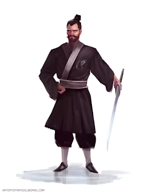

# Epizod 1: "Niebiański Kowal Sorakara porwany do Krain Cienia przez Martwe Oczy Shindame"

---

*Kampania do Legendy Pięciu Kręgów 1ed "Miecze cnót i grzechów, inaczej zwane mieczami odwróconych imion". Epizod 1 zatytułowany "Niebiański Kowal Sorakara porwany do Krain Cienia przez Martwe Oczy Shindame". Scenariusz rozgrywaliśmy w piątek 3 lutego 2023 roku.*

Ilustracja: Piotr RYGIEL

**Legenda Pięciu Kręgów 1ed**

**Kampania "Miecze cnót i grzechów, inaczej zwane mieczami odwróconych imion"**

**Epizod 1: "Niebiański Kowal Sorakara porwany do Krain Cienia przez Martwe Oczy Shindame"**

**Gatunek: samurajski, horror**

**Scena 1. "Boska Amaterasu płacze, kowal uderza w hartowane ostrze - Z każdym uderzeniem spada kolejna łza Pani Słońce, a uderzeń do wykucia dobrego miecza potrzeba naprawdę wiele - Równie wiele należy poświęcić, aby naprawić zło, które broń może wyrządzić w podatnych do jego czynienia rękach złych ludzi i tym samym sprowadzić więcej łez na niewinnych i słabych - odmienione imiona Mieczy Cnót Mistrza Sorakara"**

1105 rok kalendarza Szmaragdowego Cesarstwa. Ziemie Klanu Kraba. Burza za oknem szalała na nieboskłonie. Na dziedzińcu starej, monumentalnej kuźni słychać było trzaśnięcia piorunów. Padał deszcz. Niebo roniło łzy w rzemieślniczej muzyce. Mistrz Sorakara miarowo uderzał stal hartując kolejne warstwy ostatniego z mieczy. Wyszedł z budynku, aby dać wytchnienie swoim umęczonym w zmaganiach ze stalą ramionom. Siedem mieczy było gotowych. Każdy kolejny piękniejszy od poprzedniego. Oparte na stojaku w zdobionych pochwach na miecze Saya, prezentowały się niczym szlachetne kamienie za jubilerską wystawą. Niebiański Kowal nadał im imiona: 1. Pokora "Kenkyo", 2. Hojność "Kendai-sa", 3. Czystość "Seiketsu-sa", 4. Miłość "Ai", 5. Umiarkowanie "Tekido Ni", 6. Cierpliwość "Nintai", 7. Pracowitość "Kinben". Płomień, który tańczył w palenisku zaczął się powiększać. Zmienił kolor na czarny. Z liżących języków wyłonił się na wpół dymny, poskręcany nieludzko kształt z żółtymi ślepiami i garniturem pokaźnych zębów. Zły duch Oni Pożeracz Myśli Shiko-Kui z Zamku Umarłych Shi na Górze Duchów Yuroi włożył swoje długie, oślizgłe ramię do paszczy, zanurzając szponiastą dłoń głęboko we własnym żołądku. Ohydnym pazurem w niewidoczny sposób odwrócił imiona mieczy na: 1. Pycha "Hokori", 2. Chciwość "Don'yoku", 3. Nieczystość "Fujunbutsu", 4. Zazdrość "Shitto", 5. "Nieumiarkowanie "Fu Sekki", 6. Gniew "Ikari", 7. Lenistwo "Taida". To wystarczyło, aby skazić broń i nasączyć ją Czarną Mocą Krain Cienia. Złowroga sylwetka powróciła do ogniska. Płomienie nabrały poprzedniego wyglądu. Kowal z powrotem wszedł do kuźni i nakazał spakować prezenty.

- Cesarz Hantei godnie nagrodzi możnych Panów z Siedmiu Wielkich Klanów, którzy je otrzymają - pomyślał sługa owijający miecze w bogate jedwabie ze znakami heraldycznymi rodów...

Scena 2. "Spotkanie z Kamiennym Krabem - Generał Kaiu Ikumatsu - szczypce, które muszą wyciągnąć zaginionego Starca z Krain Fu Lenga"Bohaterowie Graczy zostają skierowani do misji wymagającej wielkiej dyskrecji. Stawiają się w Twierdzy Ostrza Brzasku Kamisori-Sano-Yoake-Shiro na wezwanie Kamiennego Kraba. Pośród papierowych ścian i świateł medytują nad sprawami otaczającego świata. Spotkanie z Generałem Kaiu Ikumatsu jest ograniczone do minimum w zakresie etykiety. Dowódca Garnizonu przechodzi do sedna w rozmowie. Bushi oddelegowani do jego służby, będą mieli za zadanie odnaleźć porwanego Niebiańskiego Kowala Pana Kaiu Sorakara. Człowiek ten na polecenie Cesarza Hantei XXXVIIII wykuł siedem mieczy, które zostały rozesłane do kluczowych władców z Siedmiu Wielkich Klanów. Ostrza zamiast służyć swoim panom zaczęły sprowadzać liczne nieszczęścia, chaos i zamieszanie. Tylko ich twórca może mieć wiedzę, co naprawdę mogło stać się z wykutymi mieczami. Samuraje przygotowują się do wyprawy w rejon Wąwozu Łez Namida w Krainach Cienia, gdzie zwiadowcy z Rodziny Hiruma widzieli grupę niezidentyfikowanych wędrowców.  Scena 3. "Goblin na plecach goblina to nie może być dobry człowiek - zasadzka w Wąwozie Łez Namida w Krainach Cienia - goblińskie bomby - w chmurze żółtych, trujących oparów trudno zachować jasność umysłu - podróż na bambusowych tykach"Cisza panująca w Krainach Cienia budzi niepokój. Krajobraz zdaje się być wykrzywiony na całej długości horyzontu. Promienie światła miejscami z trudem przebijają się przez ciemne chmury. Zniszczone budowle i zabudowania wyglądają, jak ze starożytnych grobowców. W chwilach postojów można odnieść wrażenie obecności kogoś będącego w pobliżu. Kogoś jeszcze. Powykrzywiane drzewa eksponują swoje szponiaste gałęzie. Na skałach przemykają tańczące w zwodniczych refleksach cienie. W zagłębieniu wąwozu daje się dostrzec postać. Bohaterowie Graczy decydują się ostrożnie do niej podejść. Pan Sasaki Hayato rusza frontalnie w stronę majaczącej sylwetki. Pan Bayushi Tokuno podchodzi nieznajomego zza pleców. Pan Mirumoto Kenzo ubezpiecza dwójkę towarzyszy z łuku, prowadząc obserwację ze zbocza wgłębienia terenu. Szybko okazuje się, że tajemnicza postać to dwa gobliny Bakemono. Jeden siedzi drugiemu na plecach. Zrzucają okrywający ich płaszcz, żeby w kolejnym ruchu zaatakować trującymi bombami Protagonistów. Wąwóz szybko otula chmura żółtych oparów. Bohaterowie będący w zagłębieniu tracą przytomność. Pan Mirumoto zostaje uderzony w tył głowy przez jednego z otaczających go Bakemono. Bushi są przenoszeni na bambusowych tykach niczym upolowana zwierzyna do obozowiska Dzikich Zielonoskórych.  Scena 4. "Ucieczka z obozu zbrojnej bandy goblinów Bakemono z plemienia Złodziei Zębów Ha-Dorobo - pojedynek z Martwookim Shindame na Płaskowyżu Czaszki Zugaikotsu"W klatce z bambusa samuraje spotykają porwanego Niebiańskiego Kowala Pana Kaiu Sorakara. Starzec jest wyczerpany. Bohaterowie organizują ucieczkę. Pan Bayushi Tokuno udaje trupa. Bakemono wynoszą jego ciało z dala od obozowiska, aby pod wpływem Krain Cienia nie wrócił z zaświatów w obrębie ich miejsca postoju. Mają zamiar spalić nieżywego. W międzyczasie sprytny Skorpion uwalnia się z więzów. Samuraj przekrada się do wozu z bronią. Bayushi przekazuje broń swoim kompanom. Pan Sasaki Hayato bierze na ramię Starca i przecina na pół jednego z goblińskich strażników. Pan Mirumoto wrzuca trujące bomby do ogniska, po czym pozbawia głowy Zielonoskórego. Skorpion staje do walki jeden na jednego z ubranym w czarny pancerz Martwookim. Wygrzebany Samuraj o długich, białych włosach atakuje. Pan Tokuno z łatwością odbija wykuty z ciemnej stali miecz katana Truposza. Bayushi przebija Ożywieńca rodowym ostrzem. Smolista krew plami skażoną ziemię. Ciąg dalszy nastąpi...Czarne tło...Muzyka...Napisy końcowe...W rolach głównych wystąpili:Paweł OBSTAWSKI jako bushi z Klanu Skorpiona Pan Bayushi TokunoTomasz TYMIŃSKI jako bushi z Klanu Smoka Pan Mirumoto Kenzooraz Piotr RYGIEL jako bushi z Klanu Kraba Pan Sasaki HayatoW pozostałych rolach:Martwe Oczy Shindame, Ożywiony sługa Domu Daigotsu z Zamku Umarłych Shi na Górze Duchów Yurei, Mroczny Łowczy z Klanu Pająka w Krainach Cienia. OGIEŃ 3, Zręczność 5, Inteligencja 3, ZIEMIA 2, Wytrzymałość 3, Siła Woli 2, POWIETRZE 2, Refleks 4, Intuicja 2, WODA 2, Siła 4, Spostrzegawczość 2, PUSTKA 4, katana atak 8z4, katana obrażenia 7z3, PT trafienia 20/30 (+10 ze względu na ciężką zbroję), HONOR 0.0, CHWAŁA 6.0, UMIEJĘTNOŚCI: Kenjutsu 4, Kyujutsu 4, Obrona 4, Medytacja 2, Wiedza o Krainach Cienia 5, Wiedza o shugenja 4, Taktyka 4, Jeździectwo 5, RANY 4:0, 8:-1, 12:-2, 16:-3, 20:-4, 24:Obalony, 28:Nieprzytomny, 32:Martwy, MAJĄTEK: Komplet mieczy daisho długi miecz katana z czarnej stali obrażenia 3z3 i krótki miecz wakizashi z czarnej stali obrażenia 3z2, wachlarz, ciężka zardzewiała zbroja O-yoroi w kolorze czerni z naniesionymi mrocznymi znakami Krain Cienia.

**Goblin Bakemno, Członek zbrojnej bandy Shindame z plemienia Złodziei Zębów Ha-Dorobo z Płaskowyżu Czaszki Zugaikotsu w Krainach Cienia.**
*OGIEŃ 2, Zręczność 2, Inteligencja 2, ZIEMIA 2, Wytrzymałość 2, Siła Woli 2, POWIETRZE 2, Refleks 2, Intuicja 2, WODA 2, Siła 2, Spostrzegawczość 2, PUSTKA 2, katana atak 4z2, katana obrażenia 5z2, PT trafienia 10, HONOR 0.0, CHWAŁA 0.0, UMIEJĘTNOŚCI: Kenjutsu 2, Kyujutsu 2, Obrona 2, Wiedza o Krainach Cienia 3, RANY 4:0, 8:-1, 12:-2, 16:-3, 20:-4, 24:Obalony, 28:Nieprzytomny, 32:Martwy, MAJĄTEK: Broń odebrana wrogom lub pobratymcom.*