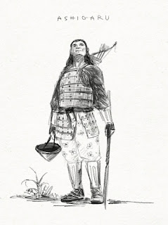

# Epizod 2: "Pierwsze ostrze to Pycha Hokori..."

---

*Kampania do Legendy Pięciu Kręgów 1ed "Miecze cnót i grzechów, inaczej zwane mieczami odwróconych imion". Epizod 2 zatytułowany "Pierwsze ostrze to Pycha Hokori, która dosięgnęła Władców Koni". Scenariusz rozgrywaliśmy w piątek 17 lutego 2023 roku.*

*Ilustracja: Piotr RYGIEL*
**Legenda Pięciu Kręgów 1edKampania "Miecze cnót i grzechów, inaczej zwane mieczami odwróconych imion"Epizod 2: "Pierwsze ostrze to Pycha Hokori, która dosięgnęła Władców Koni"**

**Gatunek: samurajski, horror, polityczny**

**Scena 1. "Meandry Miasta Władców Koni - pogrzeb Daimyo Pana Akagi Miyako - trzech synów do objęcia tronu"**
Jesień 1105 roku kalendarza Szmaragdowego Cesarstwa. Ziemie Klanu Jednorożca. Bohaterowie Graczy na polecenie Cesarza Hantei XXXVIII przybywają do Miasta Władców Koni Uma w poszukiwaniu jednego z "Mieczy Odwróconego Imienia". Książę Akagi Miyako zmarł i pozostawił testament do odczytania po jego pogrzebie. Osierocił trzech synów Pana Taro, Pana Kichiro i Pana Shuichi. Pana Taro zmogła nieznana choroba. Dworzanie powiadają, że to ta sama przypadłość, która strawiła ciało jego ojca. Pan Kichiro większość czasu spędza w domach gry i domach gejsz. Nie obchodzi go polityka. Zarzeka się, że jego ojca zamordowano. Pan Shuichi to człowiek ambitny, który zrobi wszystko, aby zdobyć władzę w mieście. Żona zmarłego Daimyo Pani Kei jest kobietą cichą i niezaangażowaną w politykę. W ośrodku handlowym prawdziwą władzę sprawuje brat wdowy Pan Ketsuki Miyagi.Scena 2. "Przerośnięta ambicja najmłodszego z synów zmarłego Daimyo Pana Akagi Shuichi - nielegalne pojedynki - tajemny krąg"Protagoniści rozpytują miejscowych o rodzinę Daimyo. Dowiadują się, że w Niemej Przystani Arimasen nad Rzeką Pamięci Memori położonej za miastem organizowane są nielegalne pojedynki, z których rekrutowani są najlepsi wojownicy do bezpośredniej obstawy Pana Akagi Shuichi. Scena 3. "Opada kurtyna sekretów - grzechy Daimyo wychodzą na jaw - opętańcza moc Miecza Pychy Hokori"Szambelan Pan Akagi Nobu zdradza, że Daimyo został otruty najprawdopodobniej przez zabójcę wysłanego z Cesarskiego Dworu. Pan Akagi Miyako miał jawny romans z faworytą cesarza Panią Chika. Miecz "Hokori" po ojcu przejął Pan Shuichi. Zmienił rękojeść zastępując ją rękojeścią Tsuka z własnego miecza. Od tego czasu zaczął przeceniać swoje umiejętności. Młodzian stopniowo pogrążał się w pysze, co w prostej linii zaczęło prowadzić go do powolnego upadku. Dąży do przewrotu w rodzinie i krwawego objęcia władzy. Bohaterowie Pan Bayushi Tokuno i Pan Sasaki Hayato w Gospodzie Polana Rogu trafiają na straże, które próbują aresztować samurajów. Czterech strażników staje naprzeciw Protagonistów. Pan Sasaki przecina pierwszego na pół, drugiego natomiast przebija na wylot mieczem katana. Pan Bayushi precyzyjnym cięciem w szyję powala adwersarza. Ostatni z ludzi Pana Shuichi ucieka. Pan Ketsuki Miyagi i Pan Mirumoto Kenzo trafiają do domu Pani Chika. Gejsza gra na samisenie i daje pokaz tańca. Samuraje orientują się, że występuje przed nimi nie kobieta, a mężczyzna. Shinobi Nocny Szpon Naitokuro z organizacji Czarna Ręka Kuroi-te zdemaskowany dobywa ukrytego pod warstwami kimono krótkiego miecz ninja-to i atakuje Bohaterów. Pan Ketsuki odbija zwodnicze ostrze i rani śmiertelnie Ninja. "Miecz Pychy Hokori" opanowuje swoją pasją Pana Miyagi. Pan Shuichi trafia do Dolnego Więzienia Shita za próbę siłowego przejęcia władzy. Po odczytaniu testamentu nowym władcą Miasta Koni Uma zostaje schorowany Pan Akagi Taro. Jego usta, tak jak usta jego ojca Pana Miyako poznały zakazaną słodycz ust Pani Chika... Kurtyzany i faworyty nigdy nie odnaleziono. Dzieci Nocy mają swoje sposoby, aby już nikt więcej niczego nie zobaczył, nie powiedział i nie uczynił...Ciąg dalszy nastąpi...Czarne tło...Muzyka...Napisy końcowe...W rolach głównych wystąpili:Paweł OBSTAWSKI jako bushi z Klanu Skorpiona Pan Bayushi TokunoTomasz TYMIŃSKI jako bushi z Klanu Smoka Pan Mirumoto KenzoPaweł PIOTROWSKI jako bushi z Klanu Jednorożca Pan Ketsuki Miyagioraz Piotr RYGIEL jako bushi z Klanu Kraba Pan Sasaki HayatoW pozostałych rolach:Samuraj z Rodziny Akagi z Klanu Jednorożca w Mieście Władców Koni Uma. Członek bezpośredniej straży syna Daimyo Pana Schuichi. OGIEŃ 2, Zręczność 2, Inteligencja 2, ZIEMIA 2, Wytrzymałość 2, Siła Woli 2, POWIETRZE 2, Refleks 2, Intuicja 2, WODA 2, Siła 2, Spostrzegawczość 2, PUSTKA 2, katana atak 4z2, katana obrażenia 5z2, PT trafienia 15 (+5 ze względu na lekką zbroję O-yoroi), HONOR 1.5, CHWAŁA 1.0, UMIEJĘTNOŚCI: Kenjutsu 2, Kyujutsu 2, Onojutsu 2, Obrona 2, Heraldyka 2, Historia 2, Taktyka 2, Jeździectwo 4, RANY 4:0, 8:-1, 12:-2, 16:-3, 20:-4, 24:Obalony, 28:Nieprzytomny, 32:Martwy, MAJĄTEK: Fioletowe kimono dobrej jakości zdobione motywami jednorożca, komplet mieczy daisho długi miecz katana obrażenia 3z2 i krótki miecz wakizashi obrażenia 2z2, koń z siodłem i oporządzeniem najlepszej jakości, lekka zbroja O-yoroi w kolorze fioletu.

**Nocny Szpon Naitokuro, Zmiennokształtny mutant z Mrocznej Szkoły Zabójców Czarnej Ręki Kuroi-te przebrany za Gejszę Panią Chika.**

*OGIEŃ 3, Zręczność 4, Inteligencja 3, ZIEMIA 2, Wytrzymałość 3, Siła Woli 2, POWIETRZE 2, Refleks 3, Intuicja 2, WODA 2, Siła 3, Spostrzegawczość 2, PUSTKA 3, ninja-to atak 7z4, katana obrażenia 5z2, RANGA 3 w szkole zabójców Shosuro, TECHNIKI: Cień nie nosi maski, Cień nie zna litości, Cień nie ma kształtu, HONOR 0.0, CHWAŁA 0.0, UMIEJĘTNOŚCI:**Ninjutsu 4, Nofujutsu 4,Tantojutsu 4, Tessenjutsu 4,**Kenjutsu 4, Kyujutsu 3, Jiujutsu 4, Obrona 2,**Wysportowanie 4,**Skradanie 4,**Wspinaczka 4,**Zastraszanie 4, Trucizny 4, Torturowanie 4, Trucizny 4, Włamywanie 4,**Aktorstwo 4, Etykieta 3, Heraldyka 2, Uwodzenie 3, Historia 2, Jeździectwo 2, Kaligrafia 2, Malarstwo 2, Medycyna 2, Muzyka 3, Polowanie 2, Poezja 2, Szczerość 4, Taniec 2,**Medytacja 2, Wiedza o shugenja 2, ZALETY: Bez serca 2, WADY: Bluźnierca 3, RANY 4:0, 8:-1, 12:-2, 16:-3, 20:-4, 24:Obalony, 28:Nieprzytomny, 32:Martwy, MAJĄTEK: Strój Gejszy, ukryty krótki miecz ninja-to obrażenia 2z2 , shurikeny obrażenia 1z1, bomba wydmuszkowa nageteppo, fukiya, duża liczba tetsubishi do spowalniania prowadzących pościg.*

"Miecz Odwróconego Imienia - Ostrze Pychy Hokori" Obrażenia 4z3. Szermierz dzierżący miecz otrzymuje Zepsucie Skazą Cienia na Poziomie 3. Może używać kości odpowiadających Poziomowi Zepsucia do poprawiania testów. To jest w teście społecznym lub w walce, w którym miecz będzie miał zastosowanie może dodać 3 kości do rzutu na powodzenie. Po wykorzystaniu miecza wykonuje test Siły Woli na poziomie 15. W przypadku oblania testu otrzymuje k10 Punktów Zepsucia. Dziesiątki na kości przerzucamy. Każde kolejne 10 Punktów Zepsucia podnosi Poziom Zepsucia Bohatera. W przypadku Zepsucia na Poziomie 4 konieczny będzie test o trudności 20, a na Poziomie Zepsucia 5 test o trudności 25, aby nie otrzymać kolejnych Punktów Zepsucia. W przypadku Zepsucia na Poziomie 6 Bohater traci kontrolę nad swoimi czynami i staje się bezwarunkowym sługą Krain Cienia.