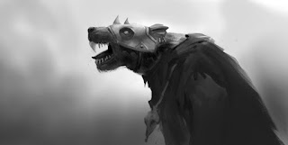

# Epizod 1: "Ogniste organy z Karak-Din"

---

*Ilustracja: Piotr RYGIELPo kolejnej długiej przerwie w środę 15 czerwca 2022 r. udało nam się rozegrać sesję w klasycznego Warhammera edycję 2. W związku z tym mamy początek Kampanii o tytule „Losy bohaterów przez żarna czasu ścierane”, która "dziedziczy" cześć elementów fabularnych z 2 Sag - Kampanii rozegranej lata temu zatytułowanej "Potęga nie dla głupców", w której Gracze wcielali się w Wojowników Chaosu stojących po drugiej stronie barykady dobra oraz Kampanii "Listy z Praag", w której Bohaterowie Graczy zwalczali Armię Wielkiego Wodza Chaosu Grobara Błądzącego jako herosi Imperium. W historii znalazły się również nawiązania do jednostrzałowej sesji rozegranej na 4 edycji Warhammera "Sukno z Langre".*

**Warhammer Fantasy Role Play 2ed**

**Kampania „Losy bohaterów przez żarna czasu ścierane”**

**Epizod 1: „Ogniste organy z Karak-Din”**

**Scena 1. Prolog. „Powołanie Połączonego Kolegium Obrony Starego Świata”**

Altdorf. Stolica Imperium. Uczestnicy spotkania na Szefa Kolegialistów
wybierają zasłużonego generała Ebbo von Rodla. Jego konkurent Guerino von
Treich próbuje zwalczać swojego rywala w politycznym wyścigu o względy Cesarza
Karla Franza. Poszczególne grupy Kolegium otrzymują zadania do wykonania na terenie
całego Starego Świata. Z Bohaterami na szlak wyrusza kislevski rycerz Ivo Kunicow.

**Scena 2. Zawiązanie akcji. „Przewóz ognistych organów z Karak-Din”**

Krasnoludzki Król Trolok Szarobrody organizuje ucztę wieńczącą interesy. Zabójca
Gotrek Gurnisson i jego kompan Felix Jaeger dostarczają ogniste organy do
Twierdzy. Protagoniści zwyciężają w pijackim pojedynku z królem brodaczy.

**Scena 3. Rozwój akcji. „Wysadzony magazyn broni w Hogenheim”**

Szary Prorok Snitril Ognisty Język poszukuje Sukna z Langre, celem uleczenia
swojego zdezintegrowanego ciała. Banda Skavenów pod jego komendą dokonuje zamachów
terrorystycznych mających na celu pozyskanie szantażem Magicznego Materiału z
Langre.

**Scena 4. Punkt kulminacyjny. „Przygotowanie do obrony Twierdzy Hog”**

W Hogenheim trwają przygotowania do obrony miasta. Bohaterowie Graczy w imieniu Cesarza przejmują kontrolę nad lokalnym garnizonem wojskowym. Kapitan straży "Ke" Kegs zostaje wtrącony do lochów za bezczynność i nieudolność. Protagoniści przeszukując komnaty włodarzy dostrzegają w Czarnym Lustrze przerażającego wojownika w zardzewiałym pancerzu z przeogromnym zakrzywionym toporem. Jego spojrzenie przenika duszę.

**Scena 5. Rozwiązanie akcji „Szaleństwo Hrabiego Kunibalda von Hogenheima”**

Hrabia otrzymał od tajemniczego eremity pelerynę, która została wykonana z
Sukna z Langre, leczącego wszelkie rany, a jednocześnie powodującego obłęd u
osoby, która je nosi. Żona hrabiego Gundelinde jest jego więźniem i ofiarą
przemocy.

**Scena 6.
Finał. „Obłąkaniec, który sam wystrzelił się z trebusza w powietrze”.**Kunibald w akcie szaleństwa wystrzeliwuje się poza mury miasta w stronę idącej
na zabudowania armii chaosu. Możny okazuje się zdrajcą, który przekazał plany obronne najeźdźcom.

**Scena 7. Epilog. „Podpalony donżon”.**

Miasto płonie. Kultyści podpalają wewnętrzny zamek. Bohaterowie Graczy ruszają
w pościg za Kunibaldem. Hrabia zostaje schwytany żywy na polach za miastem. Sukno
z Żywego Chaosu umożliwiło mu przeżycie śmiertelnego upadku. Zamek liżą płomienie.
Na horyzoncie majaczy awangarda armii Małego Wodza Chaosu Borgora Pełzającego.

Ciąg dalszy nastąpi...
Czarne tło...
Muzyka...
Napisy końcowe...

W rolach głównych wystąpili:

Krzysztof OBSTAWSKI jako Dietrich Launt
Paweł OBSTAWSKI jako Ragesh Astuana
Paweł PIOTROWSKI jako Gunter Herrmann
oraz Piotr RYGIEL jako Simon Gerb