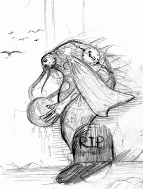

---

*W czwartek 5 stycznia 2023 r. rozgrywaliśmy epizod 10 kończący kampanię do Deadlands "Wszystkie przebrania Alistaira Kanta" zatytułowany "Czerwobog, czyli potworne oblicze Walkelina La Rue".*Ilustracja: Piotr RYGIEL
**Deadlands: Martwe ZiemieKampania "Wszystkie przebrania Alistaira Kanta"Epizod 10: "Czerwobog, czyli potworne oblicze Walkelina La Rue"**

**Scena 1. "Gałęzie Drzewa Duchów Ihitaka - broń na mrocznego maga - skalp z Trupiogrzywego"**
Bohaterowie Graczy sięgają po gałęzie nieziemskiego drzewa. Budulec zdaje się przeszywać rzeczywistość. Drewno posłuży za broń przeciwko mrocznemu władcy Domu La Rue. Timothy Crawford III zabiera ogon Trupiogrzywego jako skalp.

**Scena 2. "Narada przy bilardowym stole w saloonie 10 Shots w Redstone w Stanie Missouri"**
Posse omawia szczegóły wejścia do Tajemniczego Domu. Compadres zbroją się na potęgę przed spotkaniem z nieznanymi sobie zagrożeniami.

**Scena 3. "Celne jest oko Truposza - strzelec na skale - po drugiej stronie tafli jeziora Circle Lake"**
Hombres trafiają do miejsca tajemniczego portalu prowadzące do Domu La Rue. Wejście ukryte jest w odbiciu w wodzie. Przybytek jest niewidoczny dla ludzkich oczu. Jedynie przejście przez wyobrażenie drzwi, objawiające się w tafli jeziora, umożliwia przedostanie się „na drugą stronę”. Nagle z ukrycia padają strzały. Pierwsza kula trafia w głowę Panią Abigail Croft odbierając jej życie na miejscu. Druga przeszywa udo małego Herberta. Chłopiec umiera. Posse udaje się wykryć strzelca na jednej ze skał. Rozpoczyna się regularna wymiana ognia. Timothy trafia śmiertelnie napastnika w ramię. Mimo tego, postać zaczyna odczołgiwać się na ziemi. Mickey chce dobić Wygrzebańca. Powstrzymują go Yojiro i Weibenmauer. Jacob Hoover dobiega do rannego. Strzelcem okazuje się Rod Lake, którego dusza została uwolniona przez Protagonistów z więzienia Czerwonego Szeryfa. Żywy Trup ma włożone w czaszkę dziwne, promieniujące niebieską poświatą oczy. Przemawiając słowami Alistaira Kanta zaprasza do domu bez "niepotrzebnych przewodników". Hoover strzela w głowę Truposza. Jedynym żywym uciekinierem z domostwa jest Jean-Pierre Bassard. Malarz wprowadza Bohaterów do Dziwnego Domu.

**Scena 4. "Podróże przez własne koszmary - najlepszym wyjściem ze złych snów jest wyzbycie się strachu"**
Protagoniści rzucają się w wodę. Timothy trafia do miasteczka, w którym Indianie torturują jego rodzinę. Jacob jest w płonącym szybie kopalnianym. Yojiro trafia do Drzewa Duchów. Na gałęzi siedzi jego przyjaciel z zaszytymi ustami - japoński zabójca potworów Pan Todawa Ujinaga. Mickey wychodzi na Main Street do pojedynku. Na zegarze wybija dwunasta. Żaden z jego rewolwerów nie jest sprawny. Weibenmauer spotyka swojego ojca w mieście trawionym przez zarazę. Timothy pokonuje Indian i uwalnia rodzinę. Jacob odnajduje wyjście z kopalni. Yojiro rozcina usta samuraja. Mickey rzuca się w drzwi salonu balwierza i ucieka ze strzelaniny. Weibenmauer otrzymuje od ojca niesamowity kieszonkowy zegarek z kosmicznymi zdobieniami, który umożliwia mu opuszczenie pogrążonego w epidemii miasteczka.

**Scena 5. "Drzwi na krańcu korytarza Krainy Wielu Drzwi - wejście do Domu La Rue"**
Dwuskrzydłowe drzwi otwiera dwójka sług ubranych w smokingi. Pierwszy z nich Pan Mimo ma głowę kota. Drugi natomiast Pan Momo głowę goryla. Zapraszają nowoprzybyłych do środka. Wewnątrz trwa bal. Salę oświetlają zdobione, kryształowe żyrandole. Zgromadzeni goście to Blotki z Domu La Rue.

**Scena 6. "Rozprawa z naprawdę wielkim robalem - trutka przygotowana z Iglimory - Praojciec Czerwi Czerwobog"**
Wysoki mężczyzna w smokingu, ze starannie ułożoną falistą fryzurą i stylowo podkręconym wąsikiem wita Posse. Cieszy się, że wkrótce zasilą Galerie Osobliwości Domostwa. Walkelin przyjmuje postać Praojca Wszystkich Czerwi Czerwoboga. Ma miejsce walka na śmierć i życie. Gigantyczny robal pożera Pana Birda. Po kanciarzu zostają jedynie nogi od kolan w dół, ubrane w drogie lakierki. Mickey i Weibenmauer dostają niemal zawału na widok wynaturzenia. Jacob strzela do potwora z ręcznego karabinka Gatlinga. Timothy tworzy zasłonę ołowiu ze swojego rewolweru. Yojiro prowadzi akrobacje z mieczem katana. Setki dziur i dziesiątki ran powalają stwora. Jacob strzela kreaturze w mózg. Wielkie cielsko zamienia się w ludzką postać maga. Weibenmauer przebija serce Walkelina La Rue kołkiem z drzewa Ihitaka. Jego postać ulega zmniejszeniu i zostaje uwięziona w domku dla lalek wyrzeźbionym przez Lalkarza z Teatru Denisota - Antoina Malo.

**Scena 7. "Nowy Pan Domu La Rue - prawdziwe przeznaczenie Klausa von Weibenmauera z Rodziny Grimmów - szafa pełna różnych żyć - garderoba tożsamości"**
Weibenmauer decyduje się na objęcie funkcji „Strażnika Domu La Rue”. Po śmierci Walkelina uciekła dwójka "mieszkańców" w randze Jokera. Yojiro pozostaje z kanciarzem. Timothy, Jacob i Mickey wyładowują sakwy złotem i żegnają się z kumplami. Mickey próbuje bajać, ale sprowadza jedynie większy strach opowiadając o upadku Dworzyszcza. Dom La Rue wydawał się być czymś na kształt "szafy z istotami", w które mógł wcielać się Alistair Kant. Walkelin La Rue był zarządcą i strażnikiem osobliwej "garderoby tożsamości".

**Scena 8. "Londyński Cień Alistaira Kanta - Oślizgły Władca Czasu z Głębi Kosmosu"**
Na jednej z londyńskich ulic widać osobę w cylindrze, podpierającą się laską z motywami gwiazd ułożonych w odpowiednim porządku. Laska wskazuje na istotę z innego świata Oślizgłego Zegarmistrza. „Ty się tym zajmiesz” - mówi elegancko ubrana postać.

Czarne tło…
Muzyka…
Napisy Końcowe...
Koniec kampanii "Wszystkie przebrania Alistaira Kanta"

W rolach głównych wystąpili:

Krzysztof OBSTAWSKI jako kanciarz Klaus von Weibenmauer
Paweł OBSTAWSKI jako ronin Yojiro
Tomasz TYMIŃSKI jako rewolwerowiec Szalony Mickey
Paweł PIOTROWSKI jako rewolwerowiec, ochroniarz i początkujący kanciarz Timothy Crawford III
oraz Piotr RYGIEL jako poszukiwacz Jacob Hoover

W pozostałych rolach:

Ilustracja: Piotr RYGIELOślizgły Zegarmistrz po raz pierwszy pojawia się w scenariuszu zatytułowanym "Kontinuum zagłady" osadzonym w realiach settingu według pomysłu Pawła "Chimery" CYBULI "Apokalipsa Spełniona: Czas Cthulhu". Tekst pierwotnie został opublikowany 9 sierpnia 2012 roku na witrynie zewcthulhu.pl**Walkelin La Rue, Król Głupców, mag i właściciel Dziwnego Domostwa z Redstone. Wierny uczeń i szafarz Alistaira Kanta.**
*CHARYZMA: 2k12, Dowodzenie 4, Tresura 3, Zastraszanie 5, DUCH: 5k12, Jaja 5, Wiara: Mściciele 6, Wiara: Istoty z Mitów Cthulhu, SIŁA: 4k6, SPOSTRZEGAWCZOŚĆ: 2k10, Przenikliwość 5, Szukanie 4, Tropienie 2, SPRAWNOŚĆ: 4k10, Jeździectwo 4, Pływanie 4, Skradanie 4, Uniki 4, Walka: drewniana laska z ukrytym ostrzem 5, Wspinaczka 4, SPRYT: 4k10, Blef 5, SZYBKOŚĆ: 4k12, Dobywanie:**drewniana laska z ukrytym ostrzem 4**, Dobywanie: rewolwery 2, Dobywanie: karabiny 2, Dobywanie: strzelby 2, WIEDZA: 5k12, Wykształcenie: okultyzm 6, Wykształcenie: mity cthulhu 6, Znajomość terenu: Kraina Wiecznych Łowów 6, WIGOR: 5k12, ZRĘCZNOŚĆ: 2k12, Rzucanie: gromy zagłady 6, Strzelanie: rewolwery 2,*Strzelanie: karabiny 2, Strzelanie: strzelby 2, TEMPO: 12, ROZMIAR: 6, MOCE: Gromy zagłady 5, Iluzja 4, Mroczna ochrona 5, Nawiedzenie 3, Niewidzialny sługa 3, Ogłuszenie 4, Pakt 4, Peleryna zła 5, Przemiana 5 (Czerwobog), Przerażenie 4, Władca Marionetek 5, Zaraza 5, Zombi 3, DECH: NIE DOTYCZY, KLAMOTY: Smoking w kolorze czerni, gustowny melonik, rzeźbiona laska z motywami wijących się macek z ukrytym ostrzem obrażenia S+2k6.

**Walkelin La Rue w postaci stujardowego Praojca Wszystkich Czerwi Czerwoboga.**
*CHARYZMA: 2k10, Zastraszanie 2, DUCH: 1k8, SIŁA: 6k12+20, SPOSTRZEGAWCZOŚĆ: 2k10, SPRAWNOŚĆ: 3k6, Skradanie pod ziemią 2, Walka: wręcz 3,**Walka: gryzienie 3,**SPRYT: 2k8, SZYBKOŚĆ: 2k6, WIEDZA: 3k10, Znajomość terenu: Kraina Wiecznych Łowów 6, WIGOR: 4k12+24, ZRĘCZNOŚĆ: 1k4, TEMPO: 6 (18 pod ziemią), ROZMIAR: 20, DECH: Nie dotyczy, TERROR:11, OSŁONA: 1, Ugryzienie: obrażenia S+2k20.*