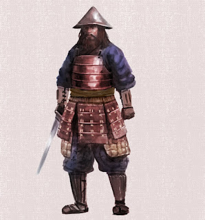

---

*Kampania do Legendy Pięciu Kręgów 1ed "Miecze cnót i grzechów, inaczej zwane mieczami odwróconych imion". Epizod 3 - Część 1 zatytułowany "Drugie ostrze to Chciwość Don'yoku, która płonie w oczach ognistych ptaków". Scenariusz rozgrywaliśmy w piątek 17 marca 2023 roku.*

*Ilustracja: Piotr RYGIEL***Legenda Pięciu Kręgów 1edKampania "Miecze cnót i grzechów, inaczej zwane mieczami odwróconych imion"Epizod 3 - Część 1: "Drugie ostrze to Chciwość Don'yoku, która płonie w oczach ognistych ptaków"Gatunek: samurajski, politycznyScena 1. "Miecz na ręce Cesarza"Nadchodzi zima 1105 roku kalendarza Szmaragdowego Cesarstwa. Bohaterowie Graczy wyjeżdżają z Miasta Władców Koni Uma położonego na ziemiach Klanu Jednorożca. Z poszukiwaczami miecza wyrusza również Pan Ketsuki Miyagi, który deklaruje oddanie Miecza Pychy Hokori osobiście na ręce Cesarza.Scena 2. "Smok daje schronienie pod swoimi skrzydłami"Protagoniści ruszają na ziemie Klanu Feniksa, gdzie trafił drugi z mieczy imieniem Chciwość Don’yoku. W międzyczasie żołnierze cesarskiej armii towarzyszący wysłannikom cesarza zmierzają do górskiego Miasta Obłoków Kumo na ziemiach Klanu Smoka, aby nie zdradzać swojej obecności i stanowić posiłki dla agentów imperatora.Scena 3. "Miasto Ognistych Ptaków Hi-no-tori - Świetlisty Kapłan Akarui"Bohaterowie przebrani za kupców trafiają do bram miasta. Ochrona w osadzie jest nadmiernie wzmożona. Dowódca straży Pan Sugawara Katsuro po wręczeniu mu łapówki przepuszcza połowę karawany. Druga połowa przekrada się niepostrzeżenie Bramą Nieczystych Kagareta. W mieście władzę sprawuje Świetlisty Kapłan Akarui, który czerpie korzyści z okradania kupców i podróżnych. Włodarz ponadto nie oddaje należnej daniny Cesarzowi.Scena 4. "Kiedy strażnicy okazują się niewprawnymi złodziejami, a okradani kupcy wyszkolonymi samurajami"W nocy pod obozowisko przebranych samurajów pochodzą żołnierze świetlistego kapłana z zamiarem pobicia i okradzenia Bohaterów Graczy. Protagoniści wraz ze swoją obstawą roznoszą na mieczach dwudziestu strażników Akarui. Wysłannicy cesarza zostają zdemaskowani. W mieście biją dzwony. Siły porządkowe podnoszą alarm…Ciąg dalszy nastąpi...Czarne tło...Muzyka...Napisy końcowe...W rolach głównych wystąpili:Tomasz TYMIŃSKI jako bushi z Klanu Smoka Pan Mirumoto KenzoPaweł PIOTROWSKI jako bushi z Klanu Jednorożca Pan Ketsuki Miyagioraz Piotr RYGIEL jako bushi z Klanu Kraba Pan Sasaki HayatoW pozostałych rolach:Samuraj z Klanu Feniksa w Mieście Ognistych Ptaków Hi-no-tori. Członek straży Świetlistego Kapłana Akarui. OGIEŃ 2, Zręczność 2, Inteligencja 2, ZIEMIA 2, Wytrzymałość 2, Siła Woli 2, POWIETRZE 2, Refleks 2, Intuicja 2, WODA 2, Siła 2, Spostrzegawczość 2, PUSTKA 2, katana atak 4z2, katana obrażenia 5z2, PT trafienia 15 (+5 ze względu na lekką zbroję O-yoroi), HONOR 1.5, CHWAŁA 1.0, UMIEJĘTNOŚCI: Kenjutsu 2, Kyujutsu 2, Onojutsu 2, Obrona 2, Heraldyka 2, Historia 2, Taktyka 2, Jeździectwo 2, RANY 4:0, 8:-1, 12:-2, 16:-3, 20:-4, 24:Obalony, 28:Nieprzytomny, 32:Martwy, MAJĄTEK: Pomarańczowe kimono dobrej jakości zdobione motywami feniksa, komplet mieczy daisho długi miecz katana obrażenia 3z2 i krótki miecz wakizashi obrażenia 2z2, koń z siodłem i oporządzeniem dobrej jakości, lekka zbroja O-yoroi w kolorze pomarańczy.