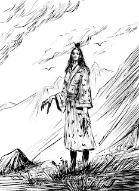

---

*Kampania do Legendy Pięciu Kręgów 1ed "Miecze cnót i grzechów, inaczej zwane mieczami odwróconych imion". Epizod 4 - Część 1 zatytułowany "Trzecie ostrze to Nieczystość Fujunbutsu, która sączy się z serca Cichego Skorpiona". Scenariusz rozgrywaliśmy w piątek 19 maja 2023 roku.*

*Ilustracja: Piotr RYGIEL*
**Legenda Pięciu Kręgów 1ed**

**Kampania "Miecze cnót i grzechów, inaczej zwane mieczami odwróconych imion"**

**Epizod 4 - Część 1: "Trzecie ostrze to Nieczystość Fujunbutsu, która sączy się z serca Cichego Skorpiona"**

**Gatunek: samurajski, horror**

**Scena 1. "Miasto Słodkich Kłamstw Amai-yuki-no-machi - niewyjawione sekrety pozostają sekretami - kolejny miecz, który zatruwa ludzkie serca"**
Wiosna 1106 roku kalendarza Szmaragdowego Cesarstwa. Pan Ketsuki Miyagi udaje się do Przystani Płaczących Drzew Shidare-ki, aby odebrać listy z Miasta Władców Koni Uma na temat stanu zdrowia schorowanego młodego Księcia Akagi Taro. Bohaterowie trafiają do Miasta Słodkich Kłamstw na ziemiach Klanu Skorpiona. W mieście od ponad pół roku dochodzi do niewyjaśnionych zaginięć kobiet. Osadą rządzi Książę Shosuro Kuno nazywany Cichym Skorpionem. Zamek jest zamknięty przed wszystkimi obcymi. Władca nie wita nowoprzybyłych wysłanników Cesarza, czyniąc im tym samym wielki afront.

Scena 2. "Imperialny agent w gnieździe skorpionów - nadworny krawiec więźniem Księcia Kuno - Pani Noya Ayame wysłana na przeszpiegi"W Amai-yuki-no-machi swoje działania pod przebraniem emisariusza z Klanu Żurawia prowadzi cesarski agent Pan Kakita Kim. Szpieg dowiaduje się, że dziwne zaginięcia kobiet zbiegają się w czasie ze zniknięciem Mieczy Odwróconego Imienia. W trakcie rozmowy w Domu Chmur Kumo-no-ie gejsza imieniem Kawai Shig przekazuje Żurawiowi, że więźniem Księcia Kuno jest nadworny krawiec Pan Kamiya Minori, będący przyjacielem Pana Bayushi Tokuno. Jego córka Pani Sumiko również zaginęła. Pan Kim wysyła na zamek swojego agenta Panią Noya Ayame w celu infiltracji dworu Cichego Skorpiona.Scena 3. "Zjawa przy Świątynnej Sadzawce Snów Yume-no-puru - walka z Cieniem Kobiety"Pół dnia drogi za miastem przy opuszczonej Świątyni Snów Yume-no-shinden spotykają się Pan Bayushi Tokuno i Pan Kakita Kim. Spotkanie jest organizowane w całkowitym sekrecie, aby nie zdemaskować szpiegowskiej obecności Żurawia. Rozmowę przerywa pojawiająca się znikąd mara. Postać przemawia metalicznym głosem. Okazuję się, że to Pani Ayame, która wróciła z zamku całkowicie odmieniona. Zjawa kobiety. Z wielkimi zębiskami i szponami, która przenika przez rzeczywistość. Zwraca się do Żurawia, że musi pozbawić go życia, gdyż takie jest życzenie jej nowego Pana. Błyskawicznie i niespodziewanie jeden ze szponów uderza w Pana Kakita. Pan Bayushi blokuje cios stwora i wyprowadza cięcie swoim niesamowitym ostrzem. Miecz godzi prosto w serce widziadła. Żuraw dźgnięciem przebija materializujące się ciało ducha. Bohaterowie postanawiają oszczędzić i odczarować skrzywdzoną Ayame. Kobieta zdradza, że stała się potworem po spędzeniu nocy z Księciem Kuno. Do miejsca przybywa Pan Shiba Takeshi. Shugenja wykorzystuje całą swoją wiedzę, aby zerwać więzy łączące dziewczynę z niewolącym jej jestestwo złym duchem Oni, którego imię pozostaje nieznane. Egzorcyzmy zakończone są powodzeniem. Kobieta nadal jednak pozostaje potworem. Pani Ayame decyduje się wesprzeć Bohaterów w zamian za pomoc w powrocie do poprzedniego życia. Shugenja przysięga, że jej pomoże. Dwórka ma skazać tajne przejście do Zamku Żądeł Sutingu-kyassuru. Protagoniści przygotowują się do siłowego szturmu na twierdzę Cichego Skorpiona. Ciąg dalszy nastąpi...Czarne tło...Muzyka...Napisy końcowe...W rolach głównych wystąpili:Krzysztof OBSTAWSKI jako shugenja z Klanu Feniksa Pan Shiba TakeshiPaweł OBSTAWSKI jako bushi z Klanu Skorpiona Pan Bayushi TokunoTomasz TYMIŃSKI jako bushi z Klanu Smoka Pan Mirumoto KenzoRafał KAMIŃSKI jako bushi z Klanu Żurawia Pan Kakita Kimoraz Piotr RYGIEL jako bushi z Klanu Kraba Pan Sasaki HayatoW pozostałych rolach:Cień Kobiety - Pani Ayame - duch poddany woli Cichego Skorpiona z Zamku Żądeł w Mieście Słodkich Kłamstw. OGIEŃ 4, Zręczność 4, Inteligencja 4, ZIEMIA 5, Wytrzymałość 5, Siła Woli 5, POWIETRZE 3, Refleks 5, Intuicja 3, WODA 5, Siła 5, Spostrzegawczość 5, PUSTKA 2, szpony atak 8z4, kły atak 8z4, szpony obrażenia 6z4, kły obrażenia 4z3, PT trafienia 25, UMIEJĘTNOŚCI: Walka: szpony 4, Walka: kły 4, RANY 6:0, 12:-1, 18:-2, 24:-3, 30:-4, 36:Obalony, 42:Nieprzytomny, 48:Martwy.