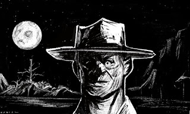

# Epizod 7: "Długie szpony Barona Morin"

---

Ilustracja: Piotr RYGIEL

W piątek 21 października 2022 r. rozgrywaliśmy epizod 7 kampanii do Deadlands "Wszystkie przebrania Alistaira Kanta" zatytułowany "Długie szpony Barona Morin".

**Deadlands: Martwe Ziemie**
**Kampania "Wszystkie przebrania Alistaira Kanta"**

**Epizod 7: "Długie szpony Barona Morin"**

**Scena 1. "Nieoczekiwany wyjazd Cartridge Jacka Biltona - brzeg rzeki Hollow River - obozowisko****"**Posse obserwuje z brzegu rzeki pokład parowca Królowa Gwiazd. Nieoczekiwanie przybywa jeździec. Timothy Crawford III prowadząc obserwację przez lunetę dostrzega, jak Catridge Jack Bilton instruuje i ponagla jednego ze swoich ludzi i Szalonego Micky'ego do wyjazdu. Posse traci swojego człowieka na statku. Grupa jeźdźców wyjeżdża w stronę Redstone. Za nimi rusza Timmy. Na statku zostaje jedynie trzech ochroniarzy. To dobry czas, aby zacząć działać.

**Scena 2. "R.R. Lafitte spółka przewozowa i park sztywnych w jednym - trumny na pokładzie - kajuty gości"**Bohaterowie Graczy dzięki "namalowanym" przez Jean-Pierre Bassarda zaproszeniom dostają się na pokład. Gośćmi balu jest okoliczna śmietanka bogaczy, właścicieli ziemskich i przedsiębiorców. Po godzinie statek wypływa. Ronin Yojiro zakrada się do kajut gości. Na korytarzu dostrzega wysokiego człowieka we fraku, zaczesanego do tyłu, podpierającego się rzeźbioną laską z wyobrażeniem anioła. W pokoju tajemniczego gościa znajduje się trumna wypełniona ziemią. W pokoju Rosaline i Rafaela Laffittów również są drewniane jesionki.

**Scena 3. "Krwawy bal Serafina Morin - As Krwi - sala balowa na statku Królowa Gwiazd"**
Na pokładzie Baron Morin wita wszystkich gości i dziękuję za przybycie na kolację. Wkrótce później objawia garnitur nienaturalnie długich zębów i straszliwe szpony. Rosaline i Rafael pokazują swoje prawdziwe tożsamości. Cała trójka jest niewidoczna w lustrach, które zdobią ściany wielkiej sali. Rozlega się panika i tumult. Ochroniarze blokują drzwi na zewnątrz. Ronin Yojiro przecina mieczem katana karabin i ramię jednego ze strażników. Zegarmistrz Weibenmauer dobywa talii kart. Wszędzie czuć zapach ozonu. Dżentelmena oplata nadnaturalny pancerz, który zdaje się czyninić go odpornym na wszelkie zranienia. Timothy Crawford III dobywa rewolweru "Poborca obietnic". Broń lśni niepokojącym blaskiem. Rewolwerowiec wymierza lufę broni i unicestwia Barona Morin, karła Rafaela Laffitta oraz jego siostrę Rosaline. Wampiry wyparowują. Zostają po nich jedynie ubrania. Crawford następnie kładzie trupem dwóch pozostałych ochroniarzy. Bohaterowie Graczy przy truchłach znajdują karty z oznaczeniami: Asa, Królowej i Waleta. Nie ma już jednak na nich podobizn Barona Morin, Rosaline Laffitte czy Rafaela. Z dokumentów znalezionych na statku wynika, że spółka R.R. Laffitte należy do Alistaira Kanta i jest zarejestrowana w Nowym Orleanie.

Ciąg dalszy nastąpi...
Czarne tło...
Muzyka...

Napisy końcowe...

W rolach głównych wystąpili:

Krzysztof OBSTAWSKI jako kanciarz Klaus von Weibenmauer
Paweł OBSTAWSKI jako ronin Yojiro
oraz Paweł PIOTROWSKI jako rewolwerowiec i ochroniarz Timothy Crawford III