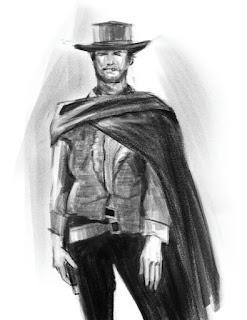

# Epizod 9: "Wędrówka do Drzewa Duchów"

---

*Ilustracja: Piotr RYGIEL*

W piątek 10 listopada 2022 r. rozgrywaliśmy epizod 9 kampanii do Deadlands "Wszystkie przebrania Alistaira Kanta" zatytułowany "Wędrówka do Drzewa Duchów".

**Deadlands: Martwe Ziemie**
**Kampania "Wszystkie przebrania Alistaira Kanta"**

**Epizod 9: "Wędrówka do Drzewa Duchów"**

**Scena 1. "Wysadzona kopalnia - zbieranie rannych - Bridgestone****"**Szalony Mickey i Jacob Hoover wyciągają z korytarzy rannych ronina Yojiro i kanciarza Weibenmauera. Posse wysadza tylne wejście do kopalni. Ludzie z bandy Skipy'ego Hogana zbierają swoich kumpli, którzy zostali postrzeleni w całej awanturze. Grupa zawala zasadnicze wejście do kompleksu. Zbiry z szajki Białych Olstr są martwi.

**Scena 2. "Powrót do miasteczka Redstone - rozmowa z Panią Abigail i małym Herbertem - historia Półczłowieka****"**Bohaterowie Graczy liżą rany w Saloonie. Posse dowiaduje się od Abigail i Herberta, że aby zgładzić Walkelina La Rue muszą wejść w posiadanie broni wykonanej z Ihitaka - Drzewa Duchów z Krainy Wiecznych Łowów, znanego również pod nazwą Iglimora. Z tego samego budulca powstała Miniaturka Domu La Rue wykonana nożem Strugacz Tożsamości przez Antoine Malo. Domek miał być pułapką, w której zostanie zamknięty Król Głupców, tak aby odbył tę samą karę, którą każdego dnia odbywały "Figury".

**Scena 3. "Podróż na granicy rzeczywistości - wielkie równiny - spotkanie ze starym Indianinem****"**Posse dociera Czarnym Dyliżansem na Wielkie Równiny. Prerię pokrywa śnieg. Bohaterowie Graczy zabierają sakwy, koce i cały sprzęt podróżny. Postaci ruszają na poszukiwania starego Indianina z bielmem na prawym oku, który zna tajemnicę przejścia do Szkarłatnego Drzewa. Po tygodniu błądzenia i niemal całkowitym wycieńczeniu odnajdują tlące się na horyzoncie małe ognisko. Przy iskrzących drwach siedzi Indianin, z którego oczu można wyczytać, że mógł być obecny przy narodzinach świata. Półczłowiek częstuje Bohaterów strawą. Protagoniści palą fajkę z Tajemniczym Wędrowcem. Z kłębów dymu wyłania się portal, który jest przejściem do Świata Szkarłatnego Drzewa. Bohaterowie Graczy przekraczają granicę znanej rzeczywistości.

**Scena 4. "Trupiogrzywy - polowanie - Szkarłatne Drzewo Duchów****"**Nieumarły koń galopuje na horyzoncie. Jest strażnikiem pradawnego miejsca. Za nim majaczy Szkarłatne Drzewo Duchów. Bohaterowie Graczy zaczynają szyć do wynaturzenia. Jego karmazynowe oczy i buchająca, trująca para z pyska zdają się przybliżać z każdą sekundą. Karty Weibenmauera nabierają świetlistych barw. Mickey prowadzi ogień z ręcznego karabinka Gatlinga. Jacob Hoover strzela z colta. Rewolwer Timothy'ego nie przestaje wypluwać z lufy gorącego ołowiu. Miecz katana błyska raniąc istotę, która już dawno powinna nie żyć. W końcu pod naporem kul, kantów i wystrzelonych nabojów wynaturzenie pada, wydobywając się z siebie przerażające rżenie.

Ciąg dalszy nastąpi...
Czarne tło...
Muzyka...

Napisy końcowe...

W rolach głównych wystąpili:

Krzysztof OBSTAWSKI jako kanciarz Klaus von Weibenmauer
Paweł OBSTAWSKI jako ronin Yojiro
Tomasz TYMIŃSKI jako rewolwerowiec Szalony Mickey
Paweł PIOTROWSKI jako rewolwerowiec, ochroniarz i początkujący kanciarz Timothy Crawford III
oraz Piotr RYGIEL jako poszukiwacz Jacob Hoover

W pozostałych rolach:

**Trupiogrzywy, Władca zwierząt z Krainy Wiecznych Łowów.**
*CHARYZMA: 1k4, Zastraszanie 6, DUCH: 4k12+6, SIŁA: 3k12+4, SPOSTRZEGAWCZOŚĆ: 2k12+4, SPRAWNOŚĆ: 5k12, Pływanie 3, Uniki 4, Walka: kopanie 5,**Walka: gryzienie 5, Walka: trujące zionięcie 5,**SPRYT: 5k8, SZYBKOŚĆ: 5k12, WIEDZA: 3k10, Znajomość terenu: Kraina Wiecznych Łowów 6, WIGOR: 5k12+6, ZRĘCZNOŚĆ: 2k8, TEMPO: 36, ROZMIAR: 9, DECH: Nie dotyczy. Ugryzienie: obrażenia S+4k6, Kopnięcie: obrażenia S+6k6, Trujące zionięcie: obrażenia 6k8, w każdej rundzie walki trafiony musi wykonać test WIGORU na PT9, w przypadku niepowodzenia cel traci kolejne k8 Tchu.*